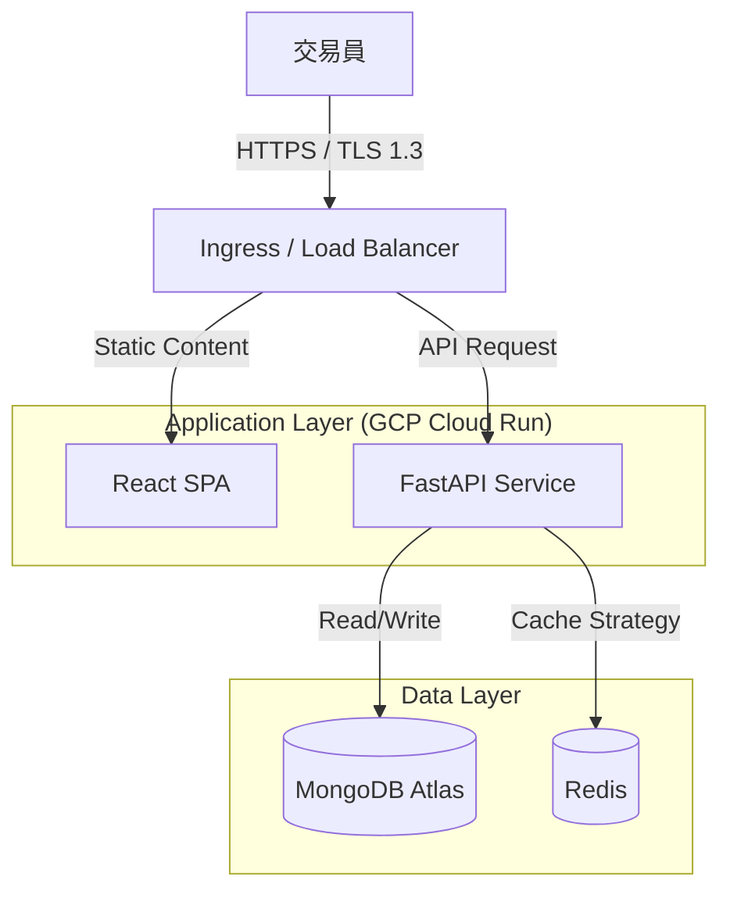

# 系統設計文件 - 全域架構 (System Design Document - Global Architecture)

**專案名稱：** TradeLedgerX  
**文件 ID：** SDD-SYSTEM  
**版本：** 1.0.0  
**日期：** 2026/01/29  
**追溯來源：** SRS v1.0.0 (由 Winston 產出之版本)

---

## 1. 系統架構總覽 (System Architecture Overview)

### 1.1 架構圖 (High-Level Architecture)

本系統採用前後端分離的微服務式架構，容器化部署於 GCP Cloud Run，確保高可用性與環境隔離。



### 1.2 技術選型與決策 (Technology Stack)

| 層級 | 技術選擇 | 設計理由與追溯 |
|------|----------|----------------|
| Frontend | React 18, TypeScript, Vite, Material UI | 採用 SPA 架構以提供流暢的操作體驗，滿足高效能需求 [Trace: NFR-001]。 |
| Backend | Python 3.11+, FastAPI, Beanie (ODM) | 非同步 (Async) 框架能有效處理並發請求，符合 API 回應速度要求 [Trace: NFR-001]。 |
| Database | MongoDB Atlas | Document 模型適合儲存結構多變的交易紀錄與標籤系統 [Trace: REQ-SYS-005, REQ-SYS-006]。 |
| Cache | Redis | 快取儀表板與日曆的高頻讀取數據，降低 DB 負載 [Trace: REQ-SYS-008]。 |
| DevOps | Docker, GCP Cloud Run | 支援容器化部署與自動擴縮，確保系統可靠性 [Trace: SRS 1.2]。 |

---

## 2. 介面設計規範 (Interface Design)

前後端通訊完全遵循 SRS 第 2 章 定義之契約。

### 2.1 API 協議 (API Contract)

- **通訊協定**: HTTP/1.1 或 HTTP/2 (over TLS)。
- **資料格式**: `Content-Type: application/json`。
- **命名慣例**:
  - URI Path: `kebab-case` (e.g., `/api/v1/daily-status`)
  - JSON Fields: `snake_case` (e.g., `entry_price`)

**標準錯誤回應 (Error Response)**:

```json
{
  "error": {
    "code": "INVALID_BROKER",
    "message": "The broker provided is not supported.",
    "request_id": "req_123abc"
  }
}
```

> **追溯**: 用於 Log 追蹤 [Trace: NFR-007]

### 2.2 標頭規範 (Header Specification)

為了滿足多帳戶管理與安全性需求，定義以下標準 Header：

| Header Name | 描述 | 追溯編號 |
|-------------|------|----------|
| `Authorization` | 格式：`Bearer <JWT_TOKEN>`，用於身份驗證。 | [Trace: SRS 2.2] |
| `X-Account-ID` | 當前操作的帳戶 ID (UUID)，後端據此過濾數據。 | [Trace: REQ-SYS-003, REQ-SYS-004] |
| `X-Request-ID` | 唯一請求 ID，用於跨服務日誌追蹤。 | [Trace: NFR-007] |

---

## 3. 安全性架構 (Security Design)

### 3.1 身份驗證與授權 (AuthN & AuthZ)

**JWT 機制**:
- Access Token 效期：30 分鐘。
- 簽章演算法：HS256 (使用 `SECRET_KEY` 環境變數)。
- **追溯**: [Trace: SRS 2.2]

**密碼儲存**:
- 使用 `bcrypt` 進行雜湊加密，確保資料庫洩漏時不暴露原始密碼。
- **追溯**: [Trace: NFR-003]

### 3.2 網路安全 (Network Security)

**CORS (跨來源資源共享)**:
- 後端 Middleware 需設定白名單，僅允許前端網域 (如 `app.tradeledgerx.com`) 發起請求。
- **追溯**: [Trace: NFR-005]

**Rate Limiting (流量限制)**:
- 針對 API Gateway 或 Application 層實作每分鐘請求限制 (e.g., 100 req/min)。
- **追溯**: [Trace: NFR-004]

---

## 4. 資料庫與快取策略 (Data & Caching Strategy)

### 4.1 索引優化 (Indexing Strategy)

為滿足效能需求 [Trace: NFR-002]，需在 MongoDB 建立以下複合索引：

- `trades: { account_id: 1, entry_date: -1 }` (加速交易列表與日曆查詢)
- `trades: { account_id: 1, status: 1 }` (加速每日風控計算 [Trace: REQ-SYS-004])

### 4.2 快取失效機制 (Cache Invalidation)

**寫入時失效 (Write-Invalidate)**:
- 當呼叫 `POST /api/v1/trades` ([Trace: REQ-SYS-006]) 新增或更新交易時，系統必須清除該 Account ID 對應的 Redis Keys。
- **影響範圍**：儀表板統計、日曆數據。

---

## 5. 部署架構 (Deployment Architecture)

### 5.1 環境隔離

系統支援透過環境變數切換行為，嚴格區分開發與正式環境。

| 環境變數 (Env Var) | 描述 | 開發值 (Dev) | 正式值 (Prod) |
|--------------------|------|--------------|---------------|
| `ENVIRONMENT` | 運行模式 | `development` | `production` |
| `MONGO_URI` | 資料庫連線 | `mongodb://localhost:27017` | `mongodb+srv://atlas...` |
| `CORS_ORIGINS` | 允許網域 | `http://localhost:3000` | `https://your-domain.com` |

### 5.2 容器編排 (Docker Compose)

為了本地開發便利性 (DX)，提供 `docker-compose.yml` 一鍵啟動所有服務。

**服務清單**: `frontend`, `backend`, `mongo`, `redis`。

---

**文件結尾**
