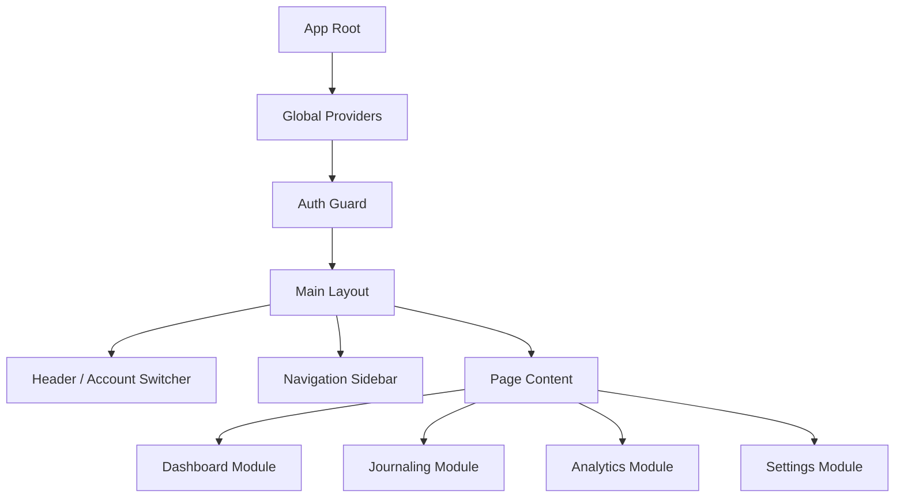

# 系統設計文件 - 前端架構 (System Design Document - Frontend)

**專案名稱：** TradeLedgerX (交易員全方位績效管理與復盤系統)  
**文件 ID：** SDD-FRONTEND  
**版本：** 1.0.0  
**日期：** 2026/01/29  
**作者：** Winston (System Architect)  
**依據：** PRD v1.0.0, SRS v1.0.0, SDD-SYSTEM v1.0.0

---

## 1. 簡介 (Introduction)

### 1.1 目的 (Purpose)

本文件旨在定義 TradeLedgerX 前端應用程式 (React SPA) 的詳細設計。重點在於如何實現 PRD 中定義的「多帳戶切換」、「風控儀表板」與「交易日誌」功能，並確保滿足 SRS 定義的 API 契約與非功能需求 (NFR)。

### 1.2 範圍 (Scope)

- **框架**：React 18 + TypeScript + Vite [Trace: SDD-SYSTEM 1.2]。
- **UI 庫**：Material UI (MUI) v5。
- **狀態管理**：Zustand (全域狀態) + React Query (伺服器狀態快取)。
- **路由**：React Router v6。

---

## 2. 前端架構設計 (Frontend Architecture)

### 2.1 應用程式結構 (Application Structure)

系統採用 Feature-based 的目錄結構，以支援模組化開發與維護。



### 2.2 核心技術決策 (Key Technical Decisions)

| 技術領域 | 解決方案 | 設計理由與追溯 |
|----------|----------|----------------|
| HTTP Client | Axios + Interceptors | 統一處理 JWT Token 與 X-Account-ID 標頭注入 [Trace: SRS 2.2, REQ-SYS-003]。 |
| Global State | Zustand | 輕量化管理 currentAccount 與 userProfile，避免 Redux 的過度複雜 [Trace: REQ-SYS-002]。 |
| Server State | TanStack Query (React Query) | 負責 API 資料快取、去重複請求與背景更新，滿足效能需求 [Trace: REQ-NFR-002]。 |
| Form Handling | React Hook Form | 優化表單渲染效能，特別是針對多選標籤 (Multi-select) 的輸入體驗 [Trace: REQ-NFR-001]。 |

---

## 3. 模組詳細設計 (Detailed Module Design)

### 3.1 認證與帳戶管理模組 (Auth & Portfolio Module)

此模組負責處理使用者登入及全局帳戶切換，是系統的核心上下文 (Context)。

**功能描述**：
- 登入後儲存 JWT 至 LocalStorage。
- 讀取使用者帳戶列表 [Trace: REQ-SYS-001]。
- 提供全局下拉選單切換當前操作帳戶。

**狀態邏輯 (Store: useAuthStore)**：
- `token: string | null`
- `accounts: Account[]`
- `activeAccountId: string | null` (持久化於 LocalStorage) [Trace: REQ-SYS-002]

**API 攔截器設計 (Axios Interceptor)**：

```typescript
// 確保所有請求自動帶入當前帳戶 ID
axiosInstance.interceptors.request.use((config) => {
  const { activeAccountId } = useAuthStore.getState();
  if (activeAccountId) {
    config.headers['X-Account-ID'] = activeAccountId; // [Trace: REQ-SYS-003]
  }
  return config;
});
```

### 3.2 風險控管儀表板 (Risk Dashboard Module)

負責即時呈現當日盈虧狀態，並給予視覺化警示。

**對應需求**：[US-002], [REQ-FUNC-002], [REQ-SYS-004]

**元件設計**：
- `DailyLossWidget`: 顯示當日虧損金額與百分比。
- `RiskProgressBar`: 視覺化進度條。

**邏輯流程**：
1. 呼叫 `GET /api/v1/risk/daily-status`。
2. 接收回傳 `{ loss_percentage, status }`。
3. UI 渲染邏輯：
   - 若 `status == 'WARNING'` (>=60%) → 進度條轉為 **黃色**。
   - 若 `status == 'DANGER'` (>=80%) → 進度條轉為 **紅色** 並加入 CSS 動畫 (Blinking) [Trace: AC-002-02]。

#### 3.3 交易日誌模組 (Journaling Module)

提供交易紀錄的 CRUD 操作，包含複雜的標籤選擇與**圖片佐證資料管理**功能。

**對應需求**：[US-004], [REQ-FUNC-004], [REQ-SYS-006]

**元件設計**：
- `TradeFormDialog`: 新增/編輯交易的 Modal，整合表單驗證 (React Hook Form)。
- `TagMultiSelect`: 封裝 MUI Autocomplete 元件，支援多選策略與錯誤標籤。
- **`MediaAttachments`: (新增) 支援輸入多組 TradingView 連結或圖片 URL (String Array)。提供即時預覽 (Preview) 與移除功能，確保復盤資料完整性 [Trace: AC-004-03]。**

**效能優化** [Trace: REQ-NFR-001]：
- 標籤列表預先載入並快取 (React Query `staleTime: Infinity`)。
- 使用 `React.memo` 防止輸入文字時導致整個表單重繪。

### 3.4 數據分析模組 (Analytics Module)

**對應需求**：[REQ-FUNC-005], [REQ-SYS-008]

**元件設計**：
- `PnLCalendar`: 自定義日曆元件。

**邏輯**：
- 根據 API 回傳的每日 PnL，動態計算單元格背景色 (Green/Red/Gray)。
- 實作 Tooltip，滑鼠懸停顯示當日交易筆數。

---

## 4. 介面與 API 整合規範 (Interface & API Integration)

### 4.1 錯誤處理 (Error Handling)

前端需統一處理後端回傳的標準錯誤格式 [Trace: SDD-SYSTEM 2.1]。

**全域錯誤邊界 (Global Error Boundary)**：
- 若收到 `401 Unauthorized` → 強制登出並重導向至 `/login`。
- 若收到 `403 Forbidden` → 顯示「權限不足」提示。
- 若收到 `422 Validation Error` → 將後端 `loc` 欄位映射至 React Hook Form 的 `setError`，在對應欄位顯示紅字錯誤 [Trace: SRS 4.0]。

### 4.2 載入狀態 (Loading States)

為滿足使用者體驗，所有資料讀取操作需實作 Skeleton Screen (骨架屏)。

- **Dashboard**: 顯示長條形骨架。
- **Data Grid**: 顯示表格骨架。

---

## 5. 需求追溯矩陣 (RTM - Frontend Scope)

本章節確保所有前端實作皆可追溯至 SRS 與 PRD。

| SRS ID | PRD ID | 功能模組 | 前端實作元件/邏輯 | 驗證標準 (AC) |
|--------|--------|----------|-------------------|---------------|
| REQ-SYS-001 | US-001 | Auth Module | useAuthStore 載入帳戶列表 | 登入後可見帳戶選單 |
| REQ-SYS-002 | US-001 | Auth Module | LocalStorage 儲存 activeAccountId | 刷新頁面後帳戶不重置 [AC-001-02] |
| REQ-SYS-003 | US-001 | API Layer | Axios Interceptor 注入 Header | API 請求包含 X-Account-ID |
| REQ-SYS-004 | US-002 | Dashboard | RiskProgressBar 元件邏輯 | >60% 黃色, >80% 紅色閃爍 [AC-002-02] |
| REQ-SYS-005 | US-003 | Settings | TagManager 頁面 (Admin Only) | 可 CRUD 標籤 |
| REQ-SYS-006 | US-004 | Journal | TradeForm 提交 JSON Payload | 成功建立包含 Tags 的交易 [AC-004-02] |
| REQ-SYS-008 | US-Implicit | Analytics | PnLCalendar 渲染邏輯 | 依 PnL 正負顯示紅綠色 |
| NFR-001 | REQ-NFR-001 | UI Core | TagMultiSelect 使用虛擬化列表 | 選單開啟無卡頓 |

---

## 6. 安全性實作 (Security Implementation)

**XSS 防護**：
- 所有使用者輸入內容 (如交易備註) 在渲染時必須經過 React 的自動跳脫處理，禁止使用 `dangerouslySetInnerHTML`。

**CSRF/CORS**：
- 前端僅透過允許的網域存取 API，並且不讀取 Cookie (Token 存於 LocalStorage，由 Header 傳遞) [Trace: NFR-005]。

**敏感資料**：
- 不在前端 Log 中印出完整的 Access Token 或 PII 資訊。

---

**文件結尾**
